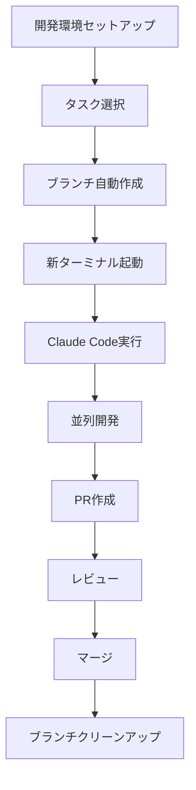

# 🚀 並列開発ガイド - Smart Display

このドキュメントでは、Smart Displayプロジェクトでローカル並列開発を行う方法を説明します。

## 🏁 クイックスタート

```bash
# 1. 開発環境をセットアップ
./scripts/setup-dev-env.sh

# 2. 並列開発を開始
./scripts/start-parallel-dev.sh weather socket responsive

# 3. 各ターミナルでClaude Codeが自動起動
```

## 📁 提供されるスクリプト

### 1. `setup-dev-env.sh` - 開発環境セットアップ
- 依存関係のインストール
- 環境変数ファイルの作成
- VS Code設定の構成
- 開発サーバー起動スクリプトの作成

### 2. `start-parallel-dev.sh` - 並列開発開始
- 指定したタスクごとに新しいブランチを作成
- 各ブランチで新しいターミナルを開く
- Claude Codeを自動実行

### 3. `branch-manager.sh` - ブランチ管理
```bash
./scripts/branch-manager.sh status  # ブランチ状態確認
./scripts/branch-manager.sh clean   # マージ済みブランチ削除
./scripts/branch-manager.sh sync    # mainとの同期
./scripts/branch-manager.sh merge   # ブランチマージ
```

### 4. `start-servers.sh` - 開発サーバー起動
- バックエンドとフロントエンドを並列起動
- 開発環境での動作確認用

## 🎯 利用可能なタスク

| タスクID | 説明 | 対象領域 |
|----------|------|----------|
| `weather` | 天気情報API統合 | Backend + Frontend |
| `socket` | Socket.ioリアルタイム通信 | Backend + Frontend |
| `responsive` | レスポンシブデザイン | Frontend |
| `testing` | テストフレームワーク設定 | Full Stack |
| `widgets` | 新しいウィジェット追加 | Frontend |
| `ui` | UIコンポーネント改善 | Frontend |
| `backend` | バックエンドAPI拡張 | Backend |
| `deploy` | デプロイメント設定 | DevOps |

## 🔄 並列開発のワークフロー



## 💻 使用例

### 3つのタスクを並列実行
```bash
./scripts/start-parallel-dev.sh weather socket responsive
```

### インタラクティブモードで選択
```bash
./scripts/start-parallel-dev.sh
# タスクを対話的に選択
```

### 特定のタスクのみ
```bash
./scripts/start-parallel-dev.sh weather
```

## 🔧 対応OS

- **macOS**: Terminal.appで新しいタブを自動作成
- **Linux**: gnome-terminal または konsole を使用
- **Windows**: WSL環境で利用可能

## 📝 開発のベストプラクティス

### 1. ブランチ戦略
- 各タスクは独立したfeatureブランチで作業
- ブランチ名: `feature/{task}-{timestamp}`
- 作業完了後はPRを作成

### 2. 競合回避
- 異なるファイル/機能を担当
- 共通部分は事前に相談
- 定期的にmainブランチと同期

### 3. コード品質
- TypeScript型定義の使用
- ESLintルールの遵守
- 適切なコミットメッセージ

### 4. コミュニケーション
```bash
# 他の開発者の状況確認
./scripts/branch-manager.sh status

# ブランチの同期
./scripts/branch-manager.sh sync
```

## 🛠️ トラブルシューティング

### ターミナルが自動起動しない
手動で新しいターミナルを開いて以下を実行:
```bash
cd /path/to/smart-screen
git checkout feature/your-branch
claude code
```

### ブランチが競合している
```bash
./scripts/branch-manager.sh sync
# 競合を手動で解決後
git add .
git commit -m "resolve merge conflicts"
```

### 依存関係エラー
```bash
# 依存関係を再インストール
cd backend && npm install
cd ../frontend && npm install
```

## 🚀 高度な使用方法

### カスタムタスクの追加
`scripts/start-parallel-dev.sh` の `TASKS` 配列にタスクを追加:

```bash
declare -A TASKS=(
    ["weather"]="天気情報API統合"
    ["your-task"]="あなたのカスタムタスク"
)
```

### 自動化スクリプトの拡張
各スクリプトは自由に編集・拡張可能です。プロジェクトの需要に合わせてカスタマイズしてください。

## 📞 サポート

問題が発生した場合:
1. このドキュメントのトラブルシューティングを確認
2. GitHubのIssuesで報告
3. プロジェクトチームに相談

---

Happy Parallel Coding! 🎉