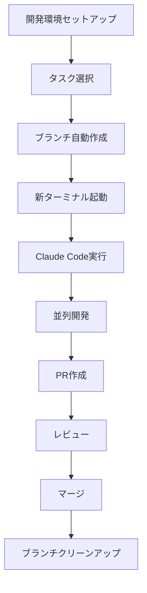

# 🚀 並列開発ガイド - Smart Display

このドキュメントでは、Smart Displayプロジェクトでローカル並列開発を行う方法を説明します。

## 🏁 クイックスタート

```bash
# 1. 開発環境をセットアップ
./scripts/setup-dev-env.sh

# 2. カスタムタスクで並列開発を開始
./scripts/start-parallel-dev.sh

# 3. プロンプトを入力して各ターミナルでClaude Codeが自動起動
```

## 📁 提供されるスクリプト

### 1. `setup-dev-env.sh` - 開発環境セットアップ
- 依存関係のインストール
- 環境変数ファイルの作成
- VS Code設定の構成
- 開発サーバー起動スクリプトの作成

### 2. `start-parallel-dev.sh` - 並列開発開始
- カスタムプロンプトでタスクを作成
- タスクごとに新しいブランチを作成
- 各ブランチで新しいターミナルを開く
- 共通ルールを自動適用してClaude Codeを実行

### 3. `branch-manager.sh` - ブランチ管理
```bash
./scripts/branch-manager.sh status  # ブランチ状態確認
./scripts/branch-manager.sh clean   # マージ済みブランチ削除
./scripts/branch-manager.sh sync    # mainとの同期
./scripts/branch-manager.sh merge   # ブランチマージ
```

### 4. `start-servers.sh` - 開発サーバー起動
- バックエンドとフロントエンドを並列起動
- 開発環境での動作確認用

## 🎯 利用可能なモード

### カスタムタスク（推奨）
自由にプロンプトを入力して、具体的なタスクを実行できます。

### テンプレートタスク
汎用的なタスクタイプから選択できます：

| テンプレートID | 説明 | 使用例 |
|----------------|------|--------|
| `frontend` | フロントエンド機能開発 | UI コンポーネント、ウィジェット追加 |
| `backend` | バックエンド機能開発 | API エンドポイント、データベース操作 |
| `fullstack` | フルスタック機能開発 | 新機能の完全実装 |
| `bugfix` | バグ修正 | 既存機能の不具合修正 |
| `refactor` | リファクタリング | コード品質向上、構造改善 |
| `test` | テスト追加・改善 | ユニットテスト、統合テスト |
| `docs` | ドキュメント更新 | README、API ドキュメント |
| `config` | 設定・環境整備 | ビルド設定、開発環境改善 |

## 🔒 共通ルール（自動適用）

すべてのタスクに以下のルールが自動適用されます：

- **ultrathink実行**: 作業開始前の必須分析・計画
- **型安全性確保**: TypeScript の厳密な型定義使用
- **既存コード調査**: コードスタイルとパターンの統一
- **エラーハンドリング**: 適切な例外処理とユーザーフィードバック
- **セキュリティ**: 機密情報保護とXSS脆弱性対策
- **品質保証**: lint・typecheck の実行確認

## 🔄 並列開発のワークフロー



## 💻 使用例

### インタラクティブモード（推奨）
```bash
./scripts/start-parallel-dev.sh
# 複数のカスタムタスクを対話的に作成
```

### カスタムタスク作成
```bash
./scripts/start-parallel-dev.sh custom
# 単一のカスタムタスクを作成
```

### テンプレートタスク使用
```bash
./scripts/start-parallel-dev.sh template frontend
# フロントエンドタスクのテンプレートを使用
```

### 複数タスクの例
```
タスク1: API統合
プロンプト: "OpenWeatherMap APIを統合して、リアルタイム天気情報を表示する機能を実装してください"

タスク2: UIコンポーネント
プロンプト: "カレンダーウィジェットを作成し、ドラッグ&ドロップで配置できるようにしてください"

タスク3: バグ修正
プロンプト: "レイアウト保存時に発生しているエラーを調査・修正してください"
```

## 🔧 対応OS

- **macOS**: Terminal.appで新しいタブを自動作成
- **Linux**: gnome-terminal または konsole を使用
- **Windows**: WSL環境で利用可能

## 📝 開発のベストプラクティス

### 1. ブランチ戦略
- 各タスクは独立したfeatureブランチで作業
- ブランチ名: `feature/{task}-{timestamp}`
- 作業完了後はPRを作成

### 2. 競合回避
- 異なるファイル/機能を担当
- 共通部分は事前に相談
- 定期的にmainブランチと同期

### 3. コード品質
- TypeScript型定義の使用
- ESLintルールの遵守
- 適切なコミットメッセージ

### 4. コミュニケーション
```bash
# 他の開発者の状況確認
./scripts/branch-manager.sh status

# ブランチの同期
./scripts/branch-manager.sh sync
```

## 🛠️ トラブルシューティング

### ターミナルが自動起動しない
手動で新しいターミナルを開いて以下を実行:
```bash
cd /path/to/smart-screen
git checkout feature/your-branch
claude code
```

### ブランチが競合している
```bash
./scripts/branch-manager.sh sync
# 競合を手動で解決後
git add .
git commit -m "resolve merge conflicts"
```

### 依存関係エラー
```bash
# 依存関係を再インストール
cd backend && npm install
cd ../frontend && npm install
```

## 🚀 高度な使用方法

### カスタムタスクの追加
`scripts/start-parallel-dev.sh` の `TASKS` 配列にタスクを追加:

```bash
declare -A TASKS=(
    ["weather"]="天気情報API統合"
    ["your-task"]="あなたのカスタムタスク"
)
```

### 自動化スクリプトの拡張
各スクリプトは自由に編集・拡張可能です。プロジェクトの需要に合わせてカスタマイズしてください。

## 📞 サポート

問題が発生した場合:
1. このドキュメントのトラブルシューティングを確認
2. GitHubのIssuesで報告
3. プロジェクトチームに相談

---

Happy Parallel Coding! 🎉